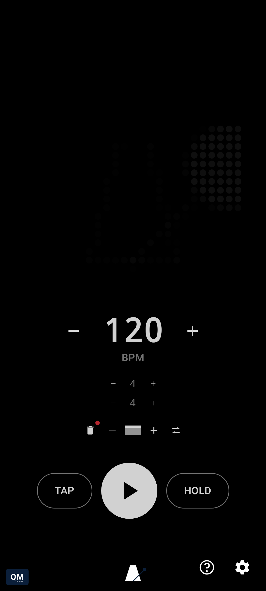
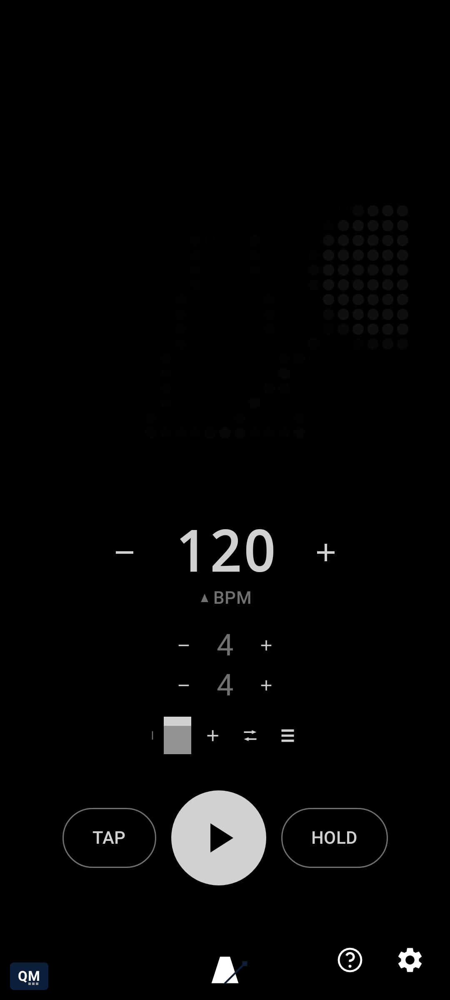
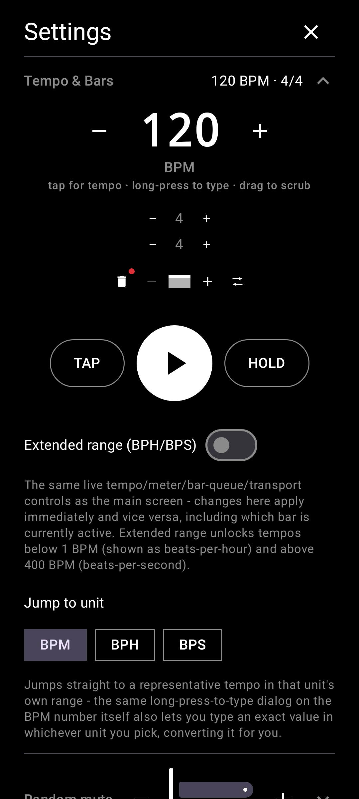

# qMetronome

A tempo/beat visualizer and functional metronome for Nothing phones with a Glyph Matrix
(Phone (3), Phone (4a) Pro), built on the [Glyph Matrix Developer Kit](https://github.com/Nothing-Developer-Programme/GlyphMatrix-Developer-Kit).

<p align="center">
  
  
  
</p>

**New here?** [`docs/user-guide.md`](docs/user-guide.md) is the visual, gesture-by-gesture guide -
every drag, tap, and toggle this app has, each with a screenshot and a short video showing it in
motion. The exact same content is also built into the app itself - tap the **?** icon next to
Settings for a live, interactive version of the same walkthrough.

This file is architecture/setup/testing. New contributors should start with
[`CONTRIBUTING.md`](CONTRIBUTING.md) — it covers building with and without
Android Studio, the project layout, and PR norms. Feasibility investigations,
manual test plans, and release readiness live in [`docs/`](docs/README.md);
decision records live in [`governance/qm/adr/`](governance/qm/adr/README.md),
inside the `governance/qm` submodule (this project's own branch of the org's
constitution repo).

## Requirements

- **Android 13 (API 33) or newer** — `minSdk`, driven by the Glyph Matrix SDK itself rather than
  anything in this app's own code (see "Setup notes" below).
- **Core metronome** (tap tempo, BPM/beats-per-bar, the bar queue, random mute, on-screen
  visualizer preview, audible click, home screen widget) works on any Android 13+ device from any
  manufacturer — no special hardware needed.
- **The physical Glyph Matrix display** only lights up on a **Nothing Phone (3) or Phone (4a)
  Pro**. On any other device the Glyph Toy button just shows a toast saying it's unsupported;
  nothing crashes.
- **MIDI clock sync** (virtual in-app-to-app, or USB) degrades gracefully on devices without MIDI
  support (`android.software.midi` is declared optional in the manifest). USB MIDI additionally
  needs a device with USB host/OTG support.

## Architecture

- `engine/MetronomeEngine` — process-wide singleton holding tempo, beat position and the
  current Glyph frame as `StateFlow`s. It's the single source of truth so the in-app preview
  and the real Glyph Matrix always show the same thing, whether or not the app UI is open. Random
  mute (`setMuteProbability`/`setProgressiveMuteEnabled`) skips the audible click on a
  probabilistic subset of beats - a practice tool for not leaning on every click - without
  touching beat position, phase, or visuals, so the visual cue and bar length never desync from
  a muted click; progressive start ramps the chance up linearly from 0 over a tunable number of
  bars (`setProgressiveMuteRampBars`, default 8) instead of applying at full strength immediately. `engine/TimeSignature` is a real "1x2 matrix"
  time signature - `beatCount` (numerator) and `unitNoteValue` (denominator, e.g. the "4" in 4/4)
  edited independently, plus its own `bpm` and `accentPattern` reserved for later. Changing
  `unitNoteValue` rescales `bpm` to preserve the underlying tempo (`bpm / unitNoteValue` held
  constant - the same "half note = 60 / quarter note = 120" equivalence real notation uses), so
  switching a bar between, say, 6/4 and 3/2 redistributes the same bar duration into 3 clicks
  instead of 6 rather than silently doubling the felt tempo. `MetronomeEngine` holds a
  *queue* of these (`timeSignatureQueue`) rather than just one - a single-entry queue (the
  default) behaves exactly like a plain, unchanging time signature and tempo, but adding more
  (`addBarToQueue`) lines up a sequence of differently-metered, differently-paced bars the engine
  cycles through at each bar boundary, applying each bar's own beat count *and* bpm as it goes
  (`setBpm` always writes into whichever bar is currently active, mirroring `setBeatsPerBar`).
  `QueueMode` controls how: `LOOP` (default) wraps back to the first bar after the last, `ONCE`
  stops advancing once it reaches the last bar (holding there rather than stopping playback
  outright), `MANUAL` never auto-advances - tapping a bar's dot in `BeatsPerBarControls` (see
  "Using the bar queue" below) is the only way to move. Queue *position* isn't staged the way
  editing a bar's own values is (staging-aware exactly as before) - navigating which bar you're
  looking at is closer to "which page am I on" than a pending settings change. `engine/ClickSound`
  separates *which* click to play from the playback plumbing (`engine/StreamingClickEngine`,
  `engine/ClickPlayer`) - a small tone table keyed by sound (today: a bigger, longer tone for a
  bar's first beat vs. every other beat) so a new sound is a new table row, not a rewrite.
- `engine/ClockSource` — produces beat ticks. `InternalClockSource` drift-corrects against
  `System.nanoTime()` so tempo doesn't slip over a long session, and re-checks the live bpm every
  30ms while waiting rather than committing to one long sleep sized for whatever tempo was in
  effect when the wait began - otherwise a drastic tempo change made while waiting out a slow
  tempo's long interval had no effect (and the beat/animation looked frozen) until that stale
  wait finished. `midi/MidiClockSource` is the
  external-clock implementation: the engine auto-switches to it the moment MIDI Clock activity
  arrives, and falls back to internal timing if that feed goes quiet for a few beats. Both this
  and `midi/MidiClockSender`'s own coroutines run on `engine/TimingDispatcher.kt`'s
  `newTimingDispatcher()` - one dedicated, elevated-priority (`THREAD_PRIORITY_URGENT_AUDIO`)
  thread per timing-critical role, isolated from `Dispatchers.Default`'s shared, general-purpose
  pool *and* from every other role, so unrelated background work elsewhere in the app - or another
  timing-critical role's own work - can never delay a beat firing. `MetronomeEngine` alone uses
  four of these (clock loop, render loop, audio-scheduling loop, and `StreamingClickEngine`'s
  sample-clocked writer - see below); a shared pool was tried first (a genuine single thread
  measurably broke it, a fast tempo's audio-scheduling poll starved the actual beat-firing
  coroutine entirely) before settling on one dedicated thread per role rather than a pool sized to
  however many roles happen to exist today.
- `midi/` — MIDI Clock (24 ppqn) support, in both directions, over both virtual (inter-app) and
  USB transports. `MidiClockSource` parses real-time bytes and measures tempo from a smoothed
  rolling average of tick intervals, regardless of transport; `VirtualMidiClockService` exposes
  the app as a MIDI destination other apps can target with no hardware (see
  `res/xml/midi_device_info.xml`). Going the other way, `MidiClockSender` generates clock from
  `MetronomeEngine.state` and writes it to a registered set of destinations. `UsbMidiConnector`
  is the USB side of both directions - `connectForFollowing()`/`connectForSending()` are
  independent, so a device can be followed, sent to, both, or neither. It's a process-wide
  singleton like `MetronomeEngine`/`MidiClockSender`, which is what lets `StarredMidiDevices`
  work: starring a device persists which connection(s) were active for it, and a
  `MidiManager.DeviceCallback` registered at app startup restores them automatically the moment
  that device reappears on the USB bus, whether or not Settings is open. See
  [`docs/external-midi-clock.md`](docs/external-midi-clock.md) for the design rationale and
  [`docs/usb-midi-test-plan.md`](docs/usb-midi-test-plan.md) for how to verify either USB
  direction (including starring/auto-reconnect) against real hardware.
- `engine/StreamingClickEngine` — the audible click, so this also works as a real metronome for
  practicing/performing musicians, with or without the Glyph Matrix. Each `ClickSound` is a
  generated waveform (`engine/ClickSynth`, tunable waveform/frequency/duration/gain - see Settings
  → Click). Rather than discretely retriggering audio per beat (which can only ever be timed by a
  coroutine waking up at approximately the right wall-clock moment), one continuously-running
  `MODE_STREAM` `AudioTrack` plays for the whole session; a dedicated writer thread mixes each
  click's waveform into the stream at an exact sample-frame offset, computed by self-calibrating
  `AudioTrack`'s frame-position/timestamp reporting against `System.nanoTime()` - timed by the
  audio hardware's own sample clock, not a wakeup. `engine/ClickPlayer` (the older discrete
  `MODE_STATIC`-retrigger implementation, `PERFORMANCE_MODE_LOW_LATENCY`) is kept as an automatic
  fallback for whatever device/OEM audio stack doesn't cooperate with `MODE_STREAM` construction or
  timestamp warm-up. See [`docs/realtime-audio-roadmap.md`](docs/realtime-audio-roadmap.md) for the
  longer-term direction (multi-channel routing, polyrhythm, per-beat-type MIDI actions) this was
  a prerequisite for.
- `visualizers/` — the animation algorithms. See below.
- `glyph/GlyphMatrixToyService` — reusable Glyph Toy boilerplate (bind lifecycle, device
  registration, Glyph Button message handling). `glyph/MetronomeGlyphService` is the concrete
  toy: it starts/stops the engine with toy selection, taps tempo on Glyph Button touch-down,
  and cycles visualizers on long-press.
- `ui/` — Compose UI. `MainScreen` keeps the Glyph Matrix preview as the dominant, focal
  element with tempo/tap/play-stop and beats-per-bar alongside it - live meter/tempo controls
  belong on the main screen, not a settings overlay you'd have to leave the beat to open.
  Everything else (a "Tempo & Bars" section embedding the *exact same* `TempoTransportCluster`
  shown on the main screen - BPM/meter/bar-queue plus TAP/play-stop/HOLD, not a second copy that
  could drift - plus an extended-BPM-range toggle, random mute, click toggle, visualizer picker,
  independent beat-visualizer/bar-queue-background toggles, visual and audio timing offsets, a
  symbol-only-controls toggle, MIDI clock status/USB connection/clock-out) lives behind the
  bottom-right settings button in `SettingsSheet`, a full-screen translucent overlay (not a
  half-open bottom sheet) so the matrix preview's flashes still glow through dimly behind it -
  the main screen itself stops composing its own tempo/transport cluster while Settings is open,
  so there's only ever one live instance of it rather than an invisible duplicate still
  recomposing underneath. The preview shows a dim ghost of
  the current visualizer at rest even when the metronome is stopped (6% brightness idle frame),
  so the AMOLED screen never looks fully off. The settings button isn't the only way in:
  long-pressing the preview also opens settings; double-tapping the preview toggles play/stop;
  swiping left/right cycles visualizers; and the BPM number itself is triple-duty — tap it for
  tap-tempo, long-press it for a unit-aware direct-entry dialog (`ui/BpmUnitEntryDialog`; range
  1–400 BPM, extendable to 0.1–12000 via Settings → Tempo & Bars, displayed/entered as BPH/BPS
  outside the normal range - switching the dialog's own BPM/BPH/BPS chips *is* the "convert
  between units" gesture, landing on a sensible starting value in whichever unit you switch to
  rather than a literal, often-nonsensical arithmetic conversion of what was typed in the old
  one), or drag it left/right for continuous fine adjustment (a one-time hint the first time it's
  shown explains all three, then never appears again). Settings' "Jump to unit" chip row is the
  same idea one level up - jump the live tempo straight into BPM/BPH/BPS range without dragging
  there. `BeatsPerBarControls` mirrors that same pattern (steppers, long-press to
  type an exact value) at a visually secondary scale just below it. A second row beneath it is
  the entry point to the bar queue - see "Using the bar queue" below - kept to explicit
  taps/buttons rather than gestures layered onto the tempo row, since a narrow label wedged
  between two small buttons turned out to be an unreliable place to also recognize a double-tap
  and a swipe. The transport row is TAP /
  play-stop / HOLD left-to-right, with play-stop enlarged as the primary action; `HoldButton`
  queues BPM and beats-per-bar changes while pressed (a classic momentary "shift key"), and can
  also be *latched* — long-press or double-tap it to make staging sticky, indicated by turning
  "recording red," until a later tap on it flushes everything and unlatches. Latching a
  beats-per-bar change doesn't take effect mid-bar; it waits for the next bar's downbeat, the
  same way a live musician would. Settings → Layout → "Compact landscape layout"
  switches from the default full-size-overflow aesthetic to a side-by-side preview+controls
  arrangement that fits in landscape without clipping. `MatrixPreview` renders the exact same
  frames as the real hardware, so visualizers can be developed and demoed without a physical
  Nothing device. The theme (`ui/theme/`) is strictly monochrome — black/white only, matching the
  Glyph Matrix and Nothing's own design language — with two deliberate exceptions: a navy accent
  (`QmNavy`) for brand chrome (the two marks in `BrandMarks.kt` - `QmBrandMark` bottom-left,
  `AppBrandMark` bottom-center - long-press either to open its GitHub page), and "recording red"
  (`RecordingRed`) reserved for transient
  state/activity indicators — a latched hold, a staged-but-not-yet-applied change, active MIDI
  clock — in the spirit of a studio tally light, not a wash of color.
- `widget/MetronomeWidget` — a home screen widget (Jetpack Glance), BPM + play/stop only.
  Updates are event-driven, not polled: `QMetronomeApp` collects `MetronomeEngine.state`,
  filters it down to just `(bpm, isPlaying)` with `distinctUntilChanged()`, and calls
  `updateAll()` only when one of those actually changes - never on the render loop's ~40Hz
  phase ticks. See [`docs/home-screen-widget.md`](docs/home-screen-widget.md) for why a
  smoothly-animating widget was deliberately ruled out rather than attempted.

## Adding a new visualizer

Implement `GlyphVisualizer`:

```kotlin
class MyVisualizer : GlyphVisualizer {
    override val id = "my_visualizer"
    override val displayName = "My Visualizer"

    override fun render(matrixSize: Int, beat: BeatPhase): IntArray {
        val canvas = GlyphCanvas(matrixSize)
        // beat.phase is 0..1 progress through the current beat, beat.isAccent marks beat 1
        canvas.filledCircle(canvas.center, canvas.center, matrixSize * 0.3f, 255)
        return canvas.toIntArray()
    }
}
```

Add an instance to `VisualizerRegistry.all` and it's done — it shows up in the in-app picker
and becomes selectable via Glyph Button long-press. No service, threading, or SDK code needed;
`render()` is called continuously by the engine and is a pure function of `BeatPhase`.

Two requirements every visualizer must meet, enforced by `VisualizerRenderTest` (see
`GlyphVisualizer`'s docs for the full rationale):

1. **The beat must read without audio** — more total light at `phase == 0` than mid-decay
   (e.g. `phase == 0.5`).
2. **Bar 1 must read distinctly from the other beats** — more total light when `isAccent` is
   true than at the same phase with `isAccent` false.

Brightness alone usually can't carry requirement 2, since it's already pushed near maximum at
`phase == 0` to satisfy requirement 1 — scale the *size* of whatever's flashing instead (see any
built-in visualizer's `accentScale` pattern). `GlyphCanvas.line()` is available alongside
`filledCircle()`/`ring()` for arm/pendulum-style visualizers.

## Setting tempo

Several input methods on the main screen, layered for different precision needs:

- **Tap tempo**: tap the **TAP** button, or tap the BPM number itself, in rhythm; BPM is derived
  from a rolling average of the last few taps. Decoupled from playback - tapping while stopped
  only dials in a tempo, it doesn't start the metronome. The one exception: while HOLD is
  *latched* (see below), tapping out a tempo (more than once) commits it and starts playback at
  that tempo and the current time signature - a deliberate "count it in and go" gesture.
- **Step buttons** (either side of the BPM number): tap for ±1 BPM, hold for a
  geometrically-accelerating repeat - the longer you hold, the faster it moves.
- **Drag-to-scrub**: press and drag the BPM number itself left/right for continuous fine
  adjustment.
- **Long-press the BPM number**: type an exact value directly.

All of these write to the same tempo, so mixing them (tap to get close, then drag to fine-tune)
just works. **HOLD** (momentary or latched - see the Architecture section above) sits between
you and the engine for BPM and beats-per-bar: while held or latched, changes are staged and
shown in "recording red" instead of applying immediately, useful for setting up the next section
of a live performance without disturbing the current one. **Settings → Clock → "Send MIDI
clock"** turns qMetronome into a MIDI clock *source* for other apps or USB gear, the mirror
image of following an external clock - see
[`docs/external-midi-clock.md`](docs/external-midi-clock.md) for both directions.

## Using the bar queue

Below the tempo controls, the time signature is shown as two independently-steppable numbers
stacked vertically (numerator over denominator, no fraction slash - a real time signature, not a
fraction), and beneath *that* is a second, smaller row for queuing up a sequence of differently
metered *and differently paced* bars (e.g. three bars of 4/4 at 90 BPM then one bar of 3/4 at 140
BPM) - every control here is an explicit tap, deliberately, not a gesture to guess at:

- **Beats and note value, each with their own steppers**: the top number (beat count) and bottom
  number (note value, e.g. the "4" in 4/4) are edited independently, each with its own +/-,
  sized a notch smaller than BPM's own steppers to keep the visual hierarchy (tempo first, meter
  second). Changing the note value rescales BPM to keep the underlying tempo the same (see
  "Architecture" above), so switching a bar between e.g. 6/4 and 3/2 changes how the clicks are
  distributed without secretly speeding up or slowing down. Long-press either number to type both
  values directly.
- **Tempo is per-bar now, not global**: switching to a different queued bar recalls *that* bar's
  own BPM along with its own beat count - set each bar's tempo the normal way (tap/steppers/drag/
  long-press on the BPM number) while it's the active one.
- **`−`/`+` buttons**: `+` appends a copy of the currently-active bar (beats, note value, and
  tempo alike) to the queue and jumps to it; `−` removes the active bar - both no-ops if it's the
  only one left. The trash icon at the far left - flagged with a small red dot as a destructive,
  unrecoverable action - clears the whole queue back to a single default bar, for starting over
  rather than removing bars one at a time.
- **Bars**: one rectangle per bar in the queue - the precise control surface for the queue. A
  bar's *width* scales with its beat count *relative to the rest of the queue* (the longest bar
  currently queued reads as the widest rectangle) and its *height* scales with its own tempo
  (faster reads taller), so the whole queue's shape is readable at a glance. Each bar is itself
  divided into one segment per beat, so the beat count reads directly off the rectangle rather
  than a separate row above it; only the active bar's current-beat segment pulses. The one bar
  actually active reads brighter than the rest. Tap a bar to jump to it; long-press to remove it
  directly.

Separately, an ambient version of the same "which bar, which beat" idea is baked directly into the
Glyph Matrix frame itself (and its on-screen `MatrixPreview` mirror, since they're the same
underlying data) via `visualizers/QueueOverlay` - loosely emulating a line of sheet music, the
usable circle splits into one horizontal row per bar, stacked top-to-bottom in queue order (taller
rows for faster bars), with beats ticking left to right within each row and only the active bar's
current beat pulsing. It's blended in behind whichever visualizer is selected rather than clipping
it, so the two interact - the beat visualizer's own bright motion shows through unchanged, and the
tick structure fills in wherever it's dark. This is deliberately a passive, ambient cue rather
than a second control surface: once a queue gets busy enough for individual bars to blur together
on the small shared canvas, the dedicated bar row above is still the precise way to navigate it.
Both update live - bars added/removed/edited, the active bar changing - whether or not the
metronome is playing.
- **Mode icon** (far right): tap to cycle how the queue advances at each bar boundary during
  playback - **Loop** (default, wraps back to the first bar after the last), **Once** (stops
  advancing once it reaches the last bar, holding there rather than stopping playback outright),
  **Manual** (never auto-advances - only tapping a dot moves it).

With only one bar (the default), a single dot shows and this row is otherwise inert - there's
nothing to queue yet, and it behaves exactly like a single, unchanging time signature and tempo.

The queue, which bar is active, and the advance mode all persist across restarts, the same as
tempo and beats-per-bar always have.

## Using the Glyph Toy

Activate it once from Settings → **Activate as Glyph Toy** (registers it with Nothing's Glyph
Button toy carousel); after that it's selected/deselected like any other toy.

**Selecting or deselecting this toy on the Glyph Button starts or stops the metronome -
intentionally, not a bug.** `MetronomeGlyphService` binds when the toy is selected and unbinds
when it isn't, and treats those as "start playing" / "stop playing" respectively (see
`glyph/MetronomeGlyphService.kt`). One consequence worth knowing: **because the Nothing OS Glyph
Interface itself closes whenever the phone is unlocked, unlocking the phone while this toy is
showing unbinds it the same way deselecting it manually would - so playback stops on unlock too,**
not just on a deliberate toy swap. There's no way to tell those two cases apart from this app's
side; both look identical (a plain service unbind) from here.

If you just want playback to survive the screen turning off, raising your phone's own
screen-timeout (or disabling screen-off) while keeping qMetronome open works today with no extra
setup. For the cases that doesn't cover - backgrounded, screen-locked, or switched away from the
Glyph Toy entirely - Settings → Playback → "Persistent playback" keeps the engine running
independent of the toy's own bind state, via a quiet foreground-service notification. It's opt-in
(off by default) and two optional prompts may appear when you turn it on (a notification
permission, a battery-optimization exemption) - both are nudges, not requirements; declining
either still leaves the feature working, just slightly less aggressively.

While the toy is showing: touching the Glyph Button taps tempo, long-press cycles visualizers -
see [`glyph/MetronomeGlyphService.kt`](app/src/main/java/media/quaternion/qmetronome/glyph/MetronomeGlyphService.kt)
for the exact gesture wiring.

## Using the widget

Long-press the home screen → **Widgets** → place qMetronome. It shows the
current BPM and a START/STOP control:

- **Tap START/STOP** to toggle the metronome — this is the same engine the
  app and the Glyph Toy use, so it stays in sync with all of them.
- **Tap anywhere else on the widget** to open the full app (for tempo,
  visualizer, or MIDI settings).
- The number updates on its own when BPM changes from the app, MIDI, or the
  widget itself — no need to remove and re-place it.

It's deliberately BPM + play/stop only, not a live mirror of the Glyph
Matrix animation — see [`docs/home-screen-widget.md`](docs/home-screen-widget.md)
for why.

## Setup notes

- `app/libs/glyph-matrix-sdk-2.0.aar` is the Glyph Matrix SDK from the Developer Kit.
- `minSdk` is 33, required by the SDK itself (the Glyph Matrix only exists on phones running
  recent Android anyway).
- The Glyph Toy preview icon (`drawable/toy_preview.xml`) is generated pixel art, not hand-drawn:
  it's produced directly from the same static-logo pose used by `ic_launcher_foreground.xml` and
  `BrandMarks.kt`'s `AppBrandMark` (see that file's doc), rasterized onto a matrix via
  `GlyphCanvas` so it reads as real Glyph Matrix pixel art rather than a smooth vector. It has
  **not** been checked against the Developer Kit's own spec images (`23112_spec.svg` /
  `25111_spec.svg`) for exact dimensions/format conventions - worth a look before shipping.

## Testing

`./gradlew test` runs the full unit test suite, including Robolectric-backed
tests for anything that touches Android framework classes (the engine's
self-healing render loop, `MetronomeSettings` persistence, MIDI clock source
arbitration) and plain-JUnit tests for the pure-Kotlin pieces (every
visualizer, `GlyphCanvas`, `VisualizerRegistry`). The visualizer tests double
as a contract check: every built-in visualizer is verified to produce a
correctly-sized, in-range frame, to flash brighter at the start of a beat
than mid-decay (the no-audio accessibility requirement - see
`GlyphVisualizer`'s docs), and to render fast enough not to lag the render
loop. `glyph/` and the real Glyph Matrix SDK aren't unit-testable here (a
closed third-party AAR with real Binder calls, not something Robolectric can
shadow) - see [`docs/usb-midi-test-plan.md`](docs/usb-midi-test-plan.md) for
how that side is verified on real hardware instead.

## Project governance

This is Quaternion Media's first mobile/cross-platform-device project, and
its decision-record discipline (`governance/qm/adr/`) is adopted from the
org's [`qm`](https://github.com/quaternionmedia/qm) constitution — vendored
as a submodule at `governance/qm`, checked out on this project's own branch
(`project/qmetronome`), which is where this project's own decision records
live (see `governance/qm/README.md`'s "Forking a new project" section for
why). Two real gaps showed up between that constitution (built around
self-hosted server infrastructure) and a sideloaded app built against a
closed hardware-vendor SDK; rather than papering over them, they're named in
[`docs/governance-perspective.md`](docs/governance-perspective.md) and the
corresponding `governance/qm/adr/` drafts, and fed back to the org as an open
question rather than resolved unilaterally.

## CI

`.github/workflows/ci.yml` runs the Glyph SDK import-boundary check (enforcing
the isolation claimed in `governance/qm/adr/DRAFT-glyph-matrix-sdk-dependency.md`),
then a full `assembleDebug` + `testDebugUnitTest`, on every push to `main` and
every pull request.

## Inspired by

- [Avi Bortnick](https://play.google.com/store/apps/developer?id=Avi+Bortnick) on the Play Store.
- [TimeGuru](https://play.google.com/store/apps/details?id=com.adambellard.timeguru) by Adam Bellard.

## License

qmetronome's own source is MIT-licensed (see [`LICENSE`](LICENSE)). That
covers everything in this repository except `app/libs/glyph-matrix-sdk-2.0.aar`,
which is a closed-source binary distributed by Nothing Technology Limited
under its own terms (see [`governance/qm/adr/DRAFT-glyph-matrix-sdk-dependency.md`](governance/qm/adr/DRAFT-glyph-matrix-sdk-dependency.md)
for why that dependency exists and how it's isolated). Third-party
dependencies pulled in via Gradle (AndroidX, Kotlin, Robolectric, etc.) remain
under their own licenses, not relicensed by this project's MIT grant.

The app's privacy policy is [`PRIVACY.md`](PRIVACY.md) — short version: no data
collection, no analytics, no network calls, settings stay on-device. See
[`docs/app-store-checklist.md`](docs/app-store-checklist.md) for what's left
before this can actually be submitted to Google Play and what's confirmed
vs. genuinely unverified about Nothing's distribution channel.

## Known limitations / next steps

- Phone (4a) Pro (`DEVICE_25111p`) is AOD-only per the kit, which only refreshes once a minute —
  not useful for live tempo. The toy currently isn't registered with `aod_support`, so on that
  device it just won't show up in the toy list; full AOD support is future work.
- External MIDI clock sync is implemented for virtual (inter-app) and USB transports, in both
  directions (following, and sending our own clock out). Following and sending to the *same* USB
  device simultaneously is allowed rather than blocked, with a UI heads-up about devices that
  echo MIDI Thru - that combination hasn't been verified against real hardware yet. MIDI Song
  Position Pointer / proper Continue support is not implemented (Continue currently behaves like
  Start - resets to beat 0). Bluetooth LE MIDI is not implemented yet (see
  `docs/external-midi-clock.md`).
- The home screen widget is BPM + play/stop only, by design - no matrix-preview thumbnail (see
  [`docs/home-screen-widget.md`](docs/home-screen-widget.md) for why a live-pulsing widget was
  ruled out, and the manual test checklist, since a placed widget isn't unit-testable here).
- USB MIDI only scans `TRANSPORT_MIDI_BYTE_STREAM` devices; a USB-MIDI 2.0/UMP-only device
  wouldn't show up in the scan yet (see the troubleshooting section in
  `docs/usb-midi-test-plan.md`).
