# qMetronome User Guide

Every gesture qMetronome has, one topic at a time - a screenshot of the real app plus a short video showing it in motion where a single still frame wouldn't tell the whole story (a drag, a swipe, a timed hold). This exact same content is also built into the app itself: tap the **?** icon next to Settings for a live, interactive version where you can actually try each control - richer than what's on this page, since it's the real thing rather than a picture of it.

*Generated from `TutorialTopics.all` - do not edit by hand; regenerate via `./gradlew generateUserGuide`.*

**Jump to:** [Tempo](#tempo) · [Time Signature](#time-signature) · [Bar Queue](#bar-queue) · [Settings & Layout](#settings--layout) · [MIDI Clock](#midi-clock) · [Glyph Matrix](#glyph-matrix)

## Tempo

### Drag to fine-tune tempo

Drag the BPM number left or right to adjust tempo continuously, instead of tapping the +/- steppers one beat at a time. Works while stopped or playing.

**In motion:**

### Scrubbing into BPH/BPS territory

With Extended range on, dragging the tempo below 1 BPM or above 400 BPM switches to beats-per-hour or beats-per-second automatically - the same drag gesture, just a wider range. Dragging back the other way returns to ordinary BPM.

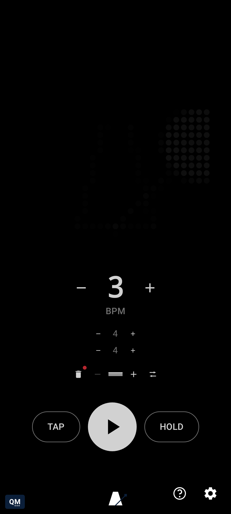

**In motion:**

### Type an exact tempo, in any unit

Long-press the BPM number to type an exact value. Chips let you pick which unit you're typing in - BPM, BPH, or BPS - converting automatically rather than making you do the math.

**In motion:**

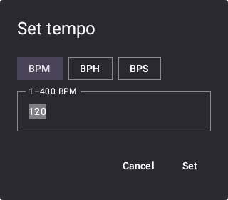

### Tap out a tempo

Tap the BPM number in rhythm to set the tempo by ear - the first tap just starts timing, the second and later taps derive a BPM from the interval between taps.

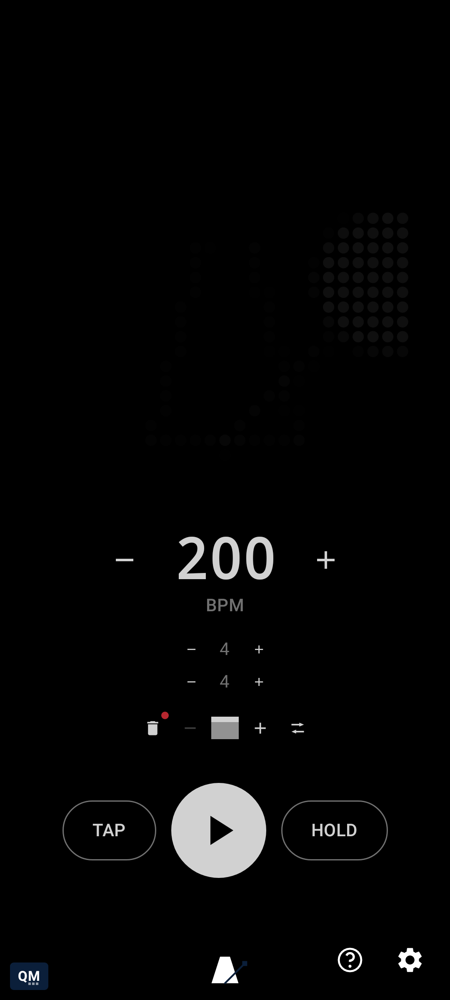

**In motion:**

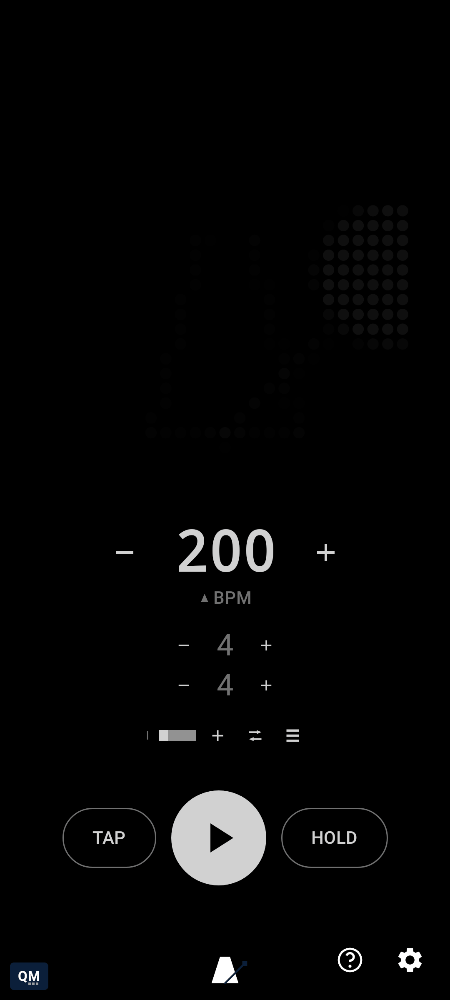

### Hold to stage a change

Press and hold HOLD, then adjust tempo or beats-per-bar - the change is staged, not applied, until you release. Release to commit it all at once, rather than the engine reacting to every intermediate value.

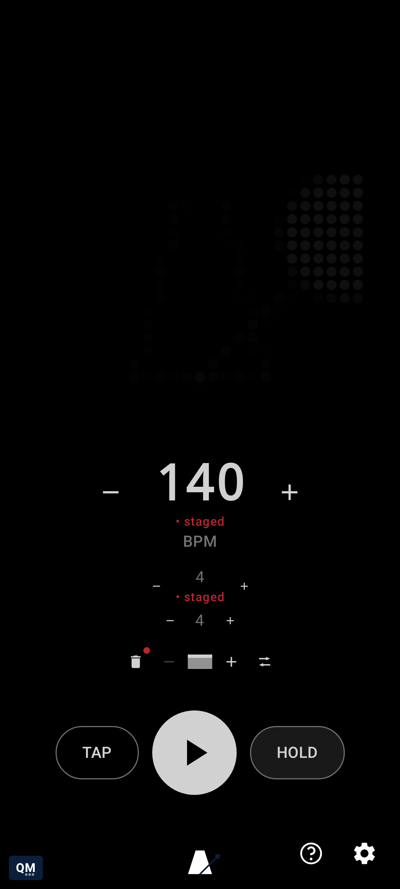

**In motion:**

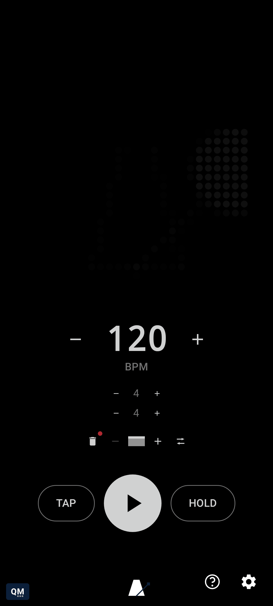

### Latch HOLD for sticky staging

Long-press or double-tap HOLD to latch it - staging stays active without holding the button down, until a later tap on HOLD flushes everything and unlatches.

**In motion:**

## Time Signature

### Drag time signature numbers

The beats-per-bar and note-value numbers scrub the same way the BPM number does - drag left or right for continuous adjustment, long-press to type an exact value.

**In motion:**

## Bar Queue

### Build a queue of bars

Add a bar to line up a sequence of differently-metered bars - each one remembers its own beats-per-bar, note value, and tempo. Tap a bar to jump to it; long-press to remove it.

**In motion:**

### Choose how the queue advances

Tap the queue mode icon to cycle between Loop (wraps back to the first bar), Once (stops advancing at the last bar), and Manual (only moves when you tap a bar directly).

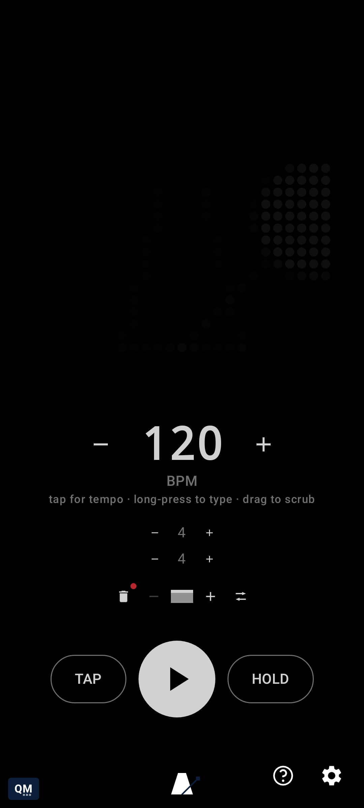

**In motion:**

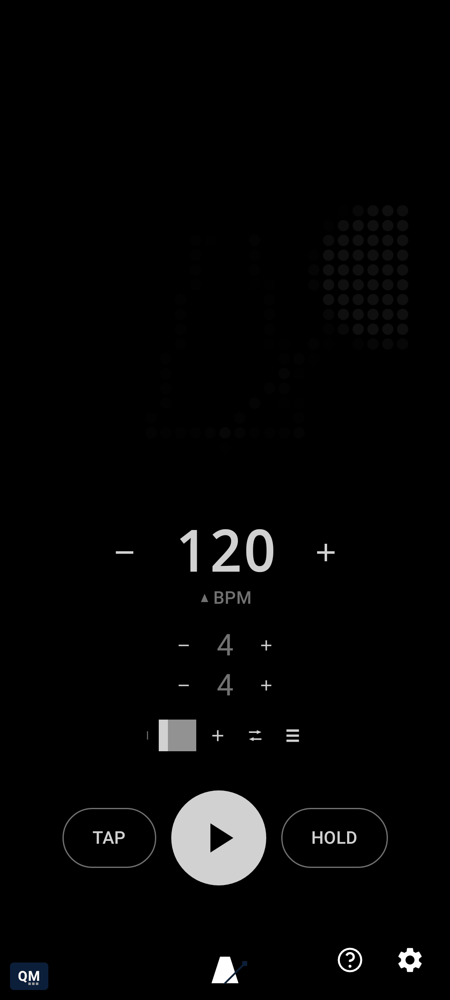

## Settings & Layout

### Jump straight to BPM/BPH/BPS

In Settings, tap a unit chip to jump the live tempo straight into that range - a quick shortcut instead of dragging or typing an exact value.

**In motion:**

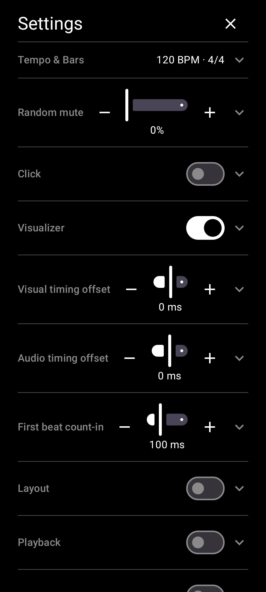

### Compact landscape layout

In Settings -> Layout, enable Compact landscape layout so rotating the phone puts the preview and controls side-by-side instead of overflowing.

**In motion:**

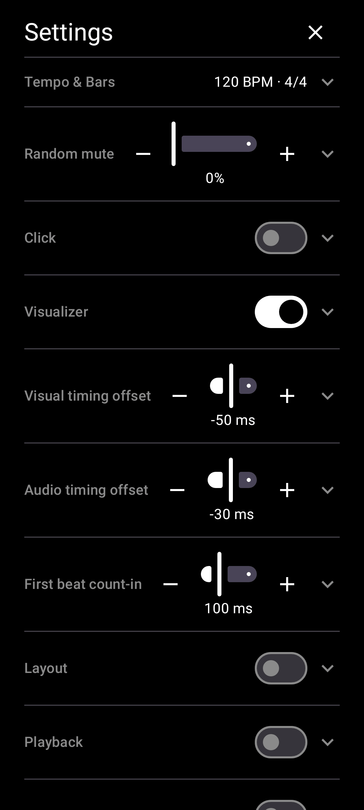

### Symbol-only controls

In Settings -> Layout, enable Symbol-only controls to drop text labels from the main screen's tempo/transport controls in favor of icons and dots.

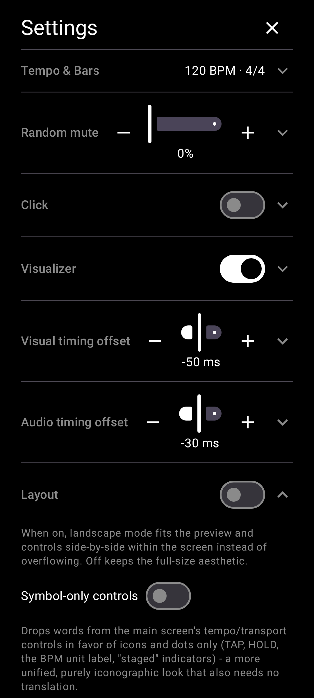

**In motion:**

## MIDI Clock

### Mechanical vs Organic outgoing clock

Mechanical actively corrects the outgoing MIDI clock for the truest, most locked-in beat. Organic lets a followed clock's own natural timing variance through unfiltered. Only affects clock sent to other apps/gear, not this app's own click or flash.

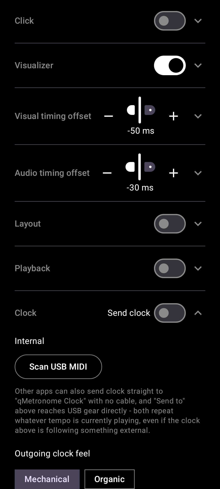

**In motion:**

## Glyph Matrix

### Swipe to cycle visualizers

Swipe the Glyph Matrix preview left or right to cycle through available visualizers.

**In motion:**

### Double-tap to play/stop

Double-tap the preview to toggle playback without reaching for the play/stop button.

**In motion:**

### Long-press to open Settings

Long-press the preview as a shortcut to Settings, in addition to the dedicated settings button.

**In motion:**

