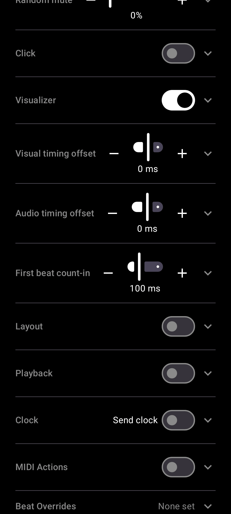

# Give one beat its own MIDI action

[← User Guide](README.md) · MIDI

In Settings -> Beat Overrides, browse to any phrase and bar (dot pickers, same as the main screen's own queues), step to any beat within it, and assign that exact beat its own MIDI action, overriding its type's default for that beat only.

