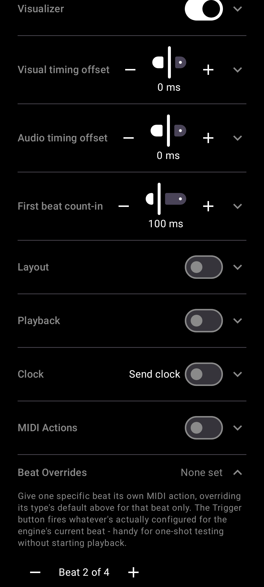

# Give one beat its own MIDI action

[← User Guide](README.md) · MIDI

In Settings -> Beat Overrides, step to any beat and assign it its own MIDI action, overriding its type's default for that beat only. The Trigger button fires whatever's configured for the engine's current beat position, for one-shot testing without starting playback.

