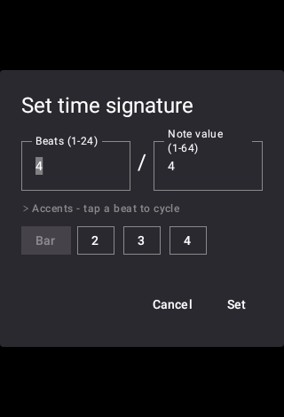

# Mark a beat as accented

[← User Guide](README.md) · Time Signature

Long-press the beats-per-bar number to open time signature entry, then tap any beat's chip to cycle it through Accent, Strong Accent, Custom, and back to unmarked. These are the same beat types the audible click and MIDI Actions can each be tuned per-beat for.

