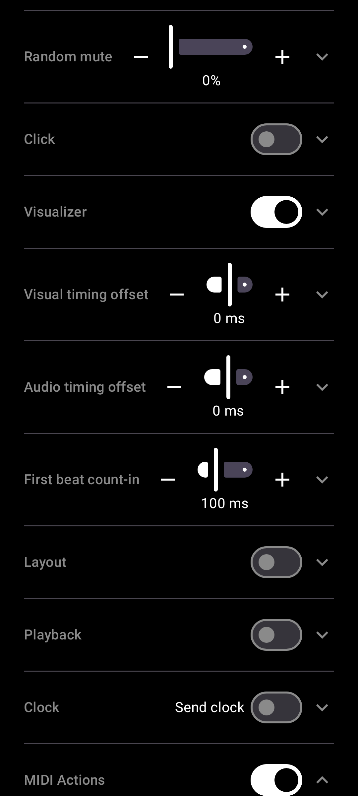

# Send MIDI notes or CC per beat type

[← User Guide](README.md) · MIDI

In Settings -> MIDI Actions, turn on beat actions and pick Note or CC for any beat type (Bar, Beat, Accent, Strong Accent, Custom) - sent over the same virtual/USB connections "Send clock" already reaches, independent of whether the audible click is on.

