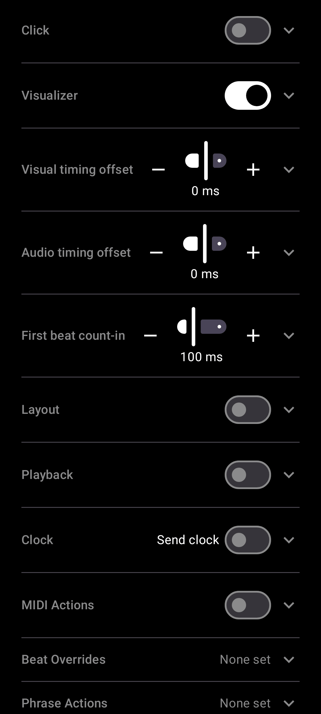

# Give a phrase its own MIDI action

[← User Guide](README.md) · MIDI

In Settings -> Phrase Actions, pick any phrase and assign it its own MIDI action, fired once whenever you jump to that phrase - tapping its dot on the main screen, or arriving there automatically as the queue advances.

