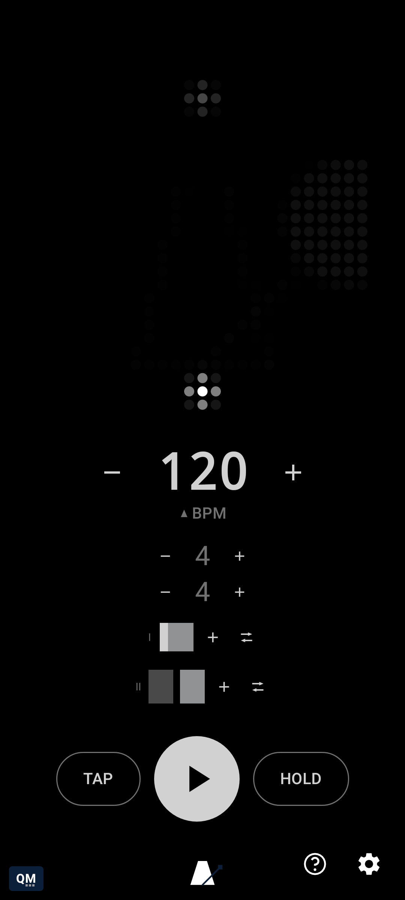

# Choose how phrases advance

[← User Guide](README.md) · Bar Queue

Once a second phrase exists, tap the phrase mode icon to cycle Loop, Once, and Manual - the same three modes the bar queue uses, one level up, governing how playback flows from one phrase into the next.

