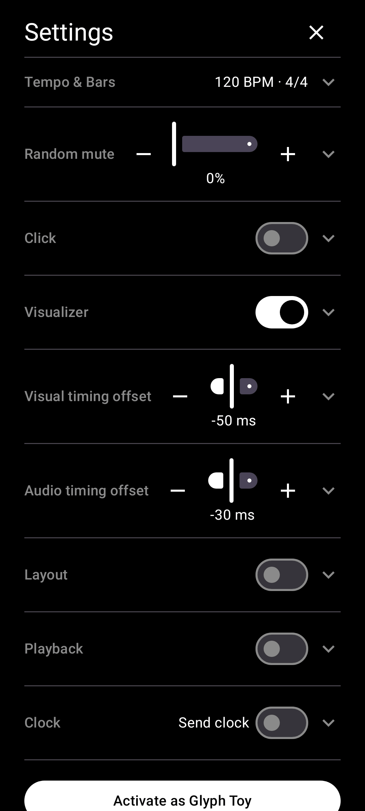

# Symbol-only controls

[← User Guide](README.md) · Settings & Layout

In Settings -> Layout, enable Symbol-only controls to drop text labels from the main screen's tempo/transport controls in favor of icons and dots.

