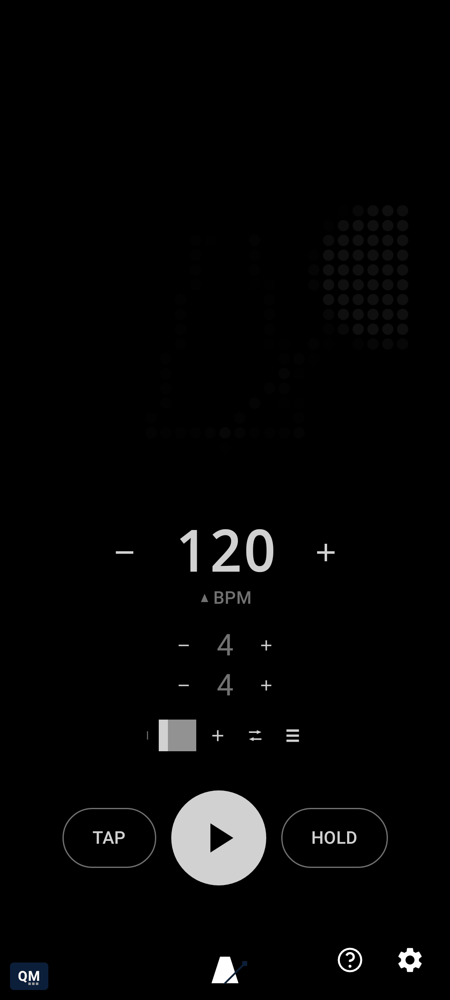

# Drag time signature numbers

[← User Guide](README.md) · Time Signature

The beats-per-bar and note-value numbers scrub the same way the BPM number does - drag left or right for continuous adjustment, long-press to type an exact value.

