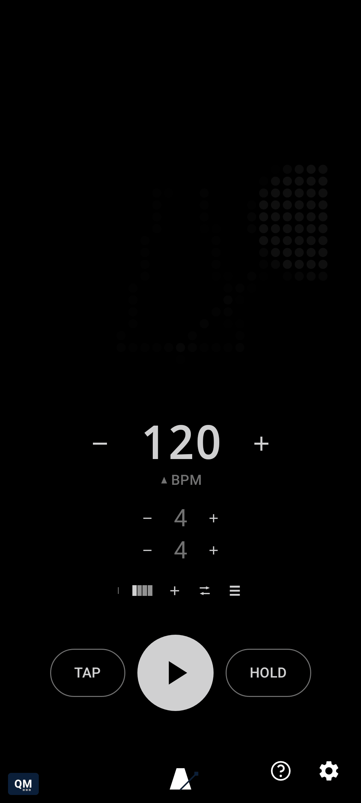

# Manually trigger a beat's MIDI action

[← User Guide](README.md) · MIDI

Once MIDI Actions is turned on, latch HOLD (long-press or double-tap it) and TAP switches from tap-tempo to a lightning-bolt Trigger button - tap it to fire whatever's actually configured for the engine's live current beat position, for one-shot testing or hand-triggering gear/lights on cue, without starting playback or leaving the latch.

