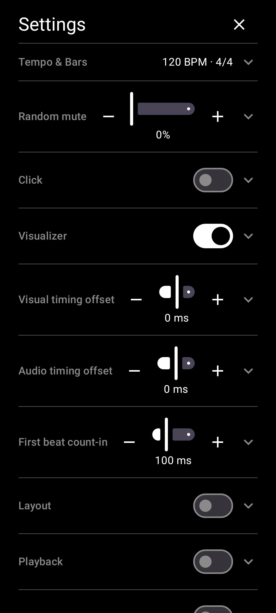

# Unit symbols

[← User Guide](README.md) · Settings & Layout

In Settings -> Layout, Unit symbols (on by default) shows a small mark next to BPM, beat type, bar, and phrase controls, naming what each one is at a glance. Turn off for a cleaner, symbol-free look.

