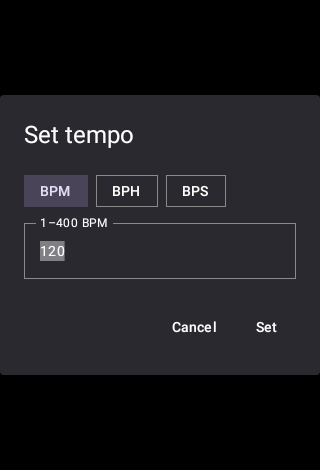
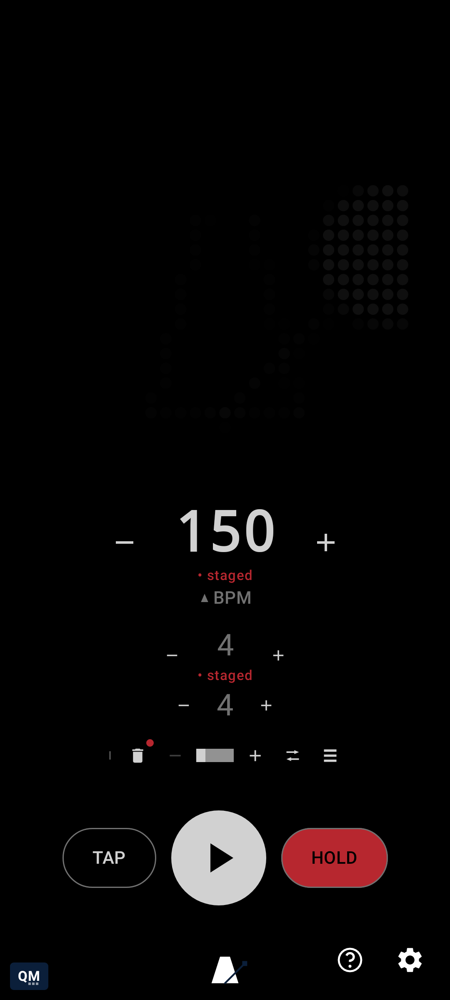
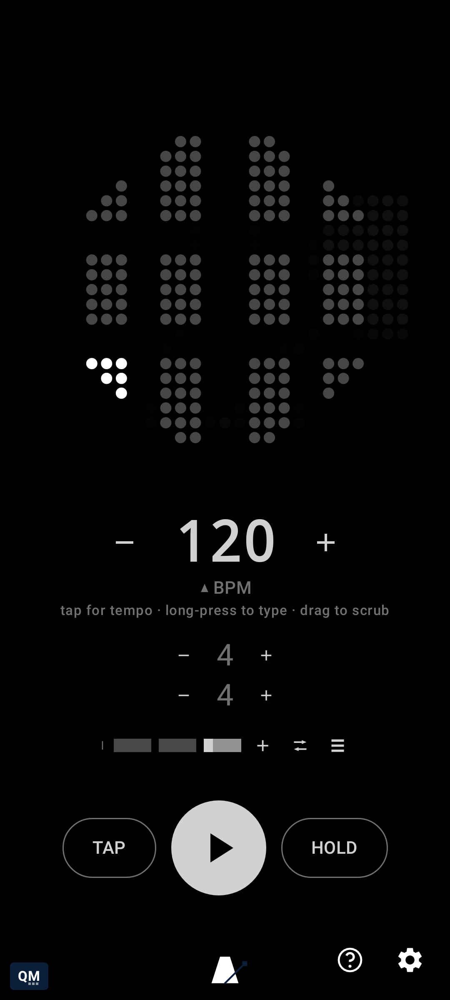

# Glossary

[← Root README](../README.md)

Reference for the classes, singletons, and mechanisms named throughout this project's docs -
alphabetical, one entry per term, each pointing at its actual file. Unlike the rest of `readme/`,
entries here can carry more than one screenshot where a second view genuinely helps - this page is
a reference to look things up in, not a story to read start to finish.

**`BpmUnit` / `BpmUnitEntryDialog`** (`ui/BpmUnit.kt`, `ui/BpmUnitEntryDialog.kt`) — BPM's
long-press dialog, unit-aware: chips switch between BPM (1–400, or 0.1–12000 with Extended range
on), BPH, and BPS mid-entry. Switching units lands on a sensible starting value in the new unit
rather than a literal, often-nonsensical arithmetic conversion of what was typed in the old one —
switching chips *is* the "convert between units" gesture. Replaces the generic
`NumericEntryDialog` for BPM specifically, since no other numeric field needs unit conversion.

**Brand marks** (`ui/BrandMarks.kt`) — `QmBrandMark` (bottom-left) and `AppBrandMark`
(bottom-center); long-press either to open its GitHub page. See "Theme colors" below for the
accent color used here.

**`ClickPlayer`** (`engine/ClickPlayer.kt`) — the older, discrete `MODE_STATIC`-retrigger click
implementation (`PERFORMANCE_MODE_LOW_LATENCY`), kept as the automatic fallback for whatever
device/OEM audio stack doesn't cooperate with `StreamingClickEngine`'s `MODE_STREAM` construction
or timestamp warm-up.

**`ClickSound` / `ClickSynth`** (`engine/ClickSound.kt`, `engine/ClickSynth.kt`) — `ClickSound`
(`BAR`, `REGULAR`, `ACCENT`, `STRONG_ACCENT`, `CUSTOM`) separates *which* click to play/which MIDI
action to fire (see `MidiActionSender`) from the playback plumbing; a new sound is a new tone-table
row, not a rewrite. Beat 0 is always `BAR`; every other beat's sound comes from that bar's
`TimeSignature.accentPattern` (a `BeatAccent` per beat, authored via the accent chips in
`ui/TimeSignatureEntryDialog.kt` — see `MetronomeEngine.beatTypeFor` for the single place that
mapping happens). `ClickSynth` renders each `ClickSound`'s `ClickSpec` (waveform/frequency/
duration/gain, tunable in Settings → Click) to samples.

**`HelpScreen`** (`ui/HelpScreen.kt`) — the in-app counterpart to `docs/user-guide/`, reached via
the **?** icon next to the Settings gear on `MainScreen`. Reads the same `TutorialTopics` content
as the generated doc; most categories embed the *real, live* production composable they're about —
the same shared-instance pattern `SettingsSheet` already established (one composed instance, wired
to the actual `MetronomeEngine`, not a disconnected demo copy), so trying a control there really
does change your tempo/settings, exactly like touching one in Settings would. The exception is
`TutorialCategory.MIDI`'s own topics beyond MIDI Actions/clock feel — Beat Overrides, Phrase
Actions, and the Trigger action currently show only their text description here, not a live control
of their own (a gap, not a design choice — see `HelpScreen`'s own `when` branch).

**`HoldButton`** (`ui/HoldButton.kt`) — the momentary/latching "shift key" for BPM and
beats-per-bar. While held, or latched, `MetronomeEngine.setBpm()`/`setBeatsPerBar()` stage instead
of applying immediately (shown in `RecordingRed`); a latched beats-per-bar change specifically
waits for the next bar's downbeat rather than applying mid-bar.

**`InternalClockSource`** (`engine/ClockSource.kt`) — the default beat-tick source. Drift-corrects
against `System.nanoTime()` so tempo doesn't slip over a long session, and re-checks the live BPM
every 30ms while waiting rather than committing to one long sleep sized for whatever tempo was in
effect when the wait began — otherwise a drastic tempo change made mid-wait had no effect (and the
beat/animation looked frozen) until that stale wait finished.

**`MainScreen`** (`ui/MainScreen.kt`) — the root Compose screen. Keeps the Glyph Matrix preview
(`MatrixPreview`) as the dominant, focal element with tempo/tap/play-stop and beats-per-bar
alongside it; everything else lives behind `SettingsSheet` or `HelpScreen`.

**`MatrixPreview`** (`ui/MatrixPreview.kt`) — renders the exact same frames as the real Glyph
Matrix hardware, so visualizers can be developed and demoed without a physical Nothing device.
Shows a dim ghost of the current visualizer at rest even when stopped (6% brightness idle frame),
so the AMOLED screen never looks fully off.

**`MetronomeEngine`** (`engine/MetronomeEngine.kt`) — the process-wide singleton holding tempo,
beat position, and the current Glyph frame as `StateFlow`s; the single source of truth so the
in-app preview and the real Glyph Matrix always show the same thing, whether or not the app UI is
open. Also owns random mute (`setMuteProbability`/`setProgressiveMuteEnabled`, which skips the
audible click on a probabilistic subset of beats without touching beat position, phase, or visuals
— a practice tool for not leaning on every click; progressive start ramps the chance up linearly
from 0 over `setProgressiveMuteRampBars`, default 8 bars, instead of applying at full strength
immediately) and the bar queue (see `TimeSignature`, `QueueMode`).

**Glyph Toy service** (`glyph/GlyphMatrixToyService.kt`, `glyph/MetronomeGlyphService.kt`) —
`GlyphMatrixToyService` is reusable Glyph Toy boilerplate (bind lifecycle, device registration,
Glyph Button message handling); `MetronomeGlyphService` is the concrete toy, starting/stopping the
engine with toy selection, tapping tempo on Glyph Button touch-down, and cycling visualizers on
long-press.

**`MetronomeWidget`** (`widget/MetronomeWidget.kt`) — the home screen widget (Jetpack Glance),
BPM + play/stop only. Updates are event-driven, not polled: `QMetronomeApp` collects
`MetronomeEngine.state`, filters it down to just `(bpm, isPlaying)` with `distinctUntilChanged()`,
and calls `updateAll()` only when one of those actually changes — never on the render loop's ~40Hz
phase ticks. No screenshot here yet - see
[A widget for the home screen](using-qmetronome/a-widget-for-the-home-screen.md) for why.

**`MidiActionSender`** (`midi/MidiActionSender.kt`) — sends a MIDI Note or CC message per beat's
resolved `ClickSound` (see `MetronomeEngine.beatTypeFor`), configured per sound in Settings → MIDI
Actions. The mirror image of `MidiClockSender` (same destination-registry shape via
`MidiReceiverRegistry`) but reactive rather than a free-running loop: called directly from
`MetronomeEngine.onBeat`, which already fires exactly once per real beat. Deliberately independent
of `clickEnabled`/mute-probability — gated only by its own `enabled` flag and each beat type's own
configured action, the same way the visual flash is unaffected by muting the audible click. `fire`
is the actual gating/send entry point; `fireForBeat` is a thin per-`ClickSound` wrapper over it -
`onBeat` resolves through `MetronomeEngine.resolveMidiActionForBeat` (type default, unless a
per-beat override is set) and calls `fire` directly, and the main screen's manual Trigger action
(TAP itself, once HOLD is latched and MIDI Actions is on — see `HoldButton`) and `Phrase.action`
both call `fire` the same way, so there is exactly one send path regardless of which of the three
configures the action.

**`MidiClockSender`** (`midi/MidiClockSender.kt`) — generates MIDI clock (24 ppqn) from
`MetronomeEngine.state` and writes it to a registered set of destinations, turning qMetronome into
a clock *source*.

**`MidiClockSource`** (`midi/MidiClockSource.kt`) — the external-clock implementation: parses
real-time MIDI bytes and measures tempo from a smoothed rolling average of tick intervals,
regardless of transport. `MetronomeEngine` auto-switches to it the moment MIDI Clock activity
arrives, and falls back to `InternalClockSource` if that feed goes quiet for a few beats.

**`Phrase`** (`engine/Phrase.kt`) — one entry in `MetronomeEngine`'s phrase queue: a song-form
section ("Verse", "Chorus") carrying its own full bar queue and its own `QueueMode`. A single-phrase
list (the default) behaves exactly like there being no phrase concept at all — `timeSignatureQueue`/
`queueIndex`/`queueMode` always mirror `phrases[activePhraseIndex]`, so every bar-queue control keeps
working unmodified for that common case. `phraseQueueMode` governs how *phrases* advance into each
other, the same `QueueMode` reused one level up — see `QueueMode`'s own entry below. `action` is
this phrase's own `MidiBeatAction` (Settings → Phrase Actions), fired once via
`MidiActionSender.fire` every time `MetronomeEngine.goToPhrase` resolves to it — NONE by default,
so a phrase nobody has configured this for stays silent.

**`QueueMode`** — how the bar queue advances at each bar boundary during playback: `LOOP` (default)
wraps back to the first bar after the last; `ONCE` stops advancing once it reaches the last bar
(holding there rather than stopping playback outright); `MANUAL` never auto-advances — tapping a
bar's dot is the only way to move. Queue *position* isn't staged the way editing a bar's own values
is (staging-aware exactly the same as everything else in `MetronomeEngine`) — navigating which bar
you're looking at is closer to "which page am I on" than a pending settings change. The same enum
governs how *phrases* (see `Phrase`) advance into each other, one level up — a phrase's own bars
falling through to `ONCE`'s "nothing left to advance to" is what triggers a phrase-boundary transition (see
`MetronomeEngine.advanceQueueAtBarBoundary`'s own kdoc for the exact trigger condition).

**`QueueOverlay`** (`visualizers/QueueOverlay.kt`) — an ambient version of "which bar, which beat"
baked directly into the Glyph Matrix frame itself (and its on-screen `MatrixPreview` mirror).
Loosely emulates a line of sheet music: the usable circle splits into one horizontal row per bar,
stacked top-to-bottom in queue order (taller rows for slower bars), with beats ticking left to
right and only the active bar's current beat pulsing. Blended in behind whichever visualizer is
selected rather than clipping it, so the two interact — deliberately a passive, ambient cue rather
than a second control surface.

**`SettingsSheet`** (`ui/SettingsSheet.kt`) — the full-screen translucent overlay (not a half-open
bottom sheet, so the matrix preview's flashes still glow through dimly behind it) holding
everything not on the main screen: a "Tempo & Bars" section embedding the *exact same*
`TempoTransportCluster` shown on the main screen (not a second copy that could drift), plus the
extended-BPM-range toggle, random mute, click toggle, visualizer picker, independent
beat-visualizer/bar-queue-background toggles, visual and audio timing offsets, a symbol-only-
controls toggle, and MIDI clock status/USB connection/clock-out. `MainScreen` stops composing its
own tempo/transport cluster while Settings is open, so there's only ever one live instance of it
rather than an invisible duplicate still recomposing underneath.

**`StarredMidiDevices`** (`midi/StarredMidiDevices.kt`) — persists which connection(s) (following,
sending, or both) were active for a starred USB MIDI device; a `MidiManager.DeviceCallback`
registered at app startup restores them automatically the moment that device reappears on the USB
bus, whether or not Settings is open.

**`StreamingClickEngine`** (`engine/StreamingClickEngine.kt`) — the primary audible-click
implementation. Rather than discretely retriggering audio per beat (which can only ever be timed
by a coroutine waking up at approximately the right wall-clock moment), one continuously-running
`MODE_STREAM` `AudioTrack` plays for the whole session; a dedicated writer thread mixes each
click's waveform into the stream at an exact sample-frame offset, computed by self-calibrating
`AudioTrack`'s frame-position/timestamp reporting against `System.nanoTime()` — timed by the audio
hardware's own sample clock, not a wakeup.

**Theme colors** (`ui/theme/`) — strictly monochrome (black/white only, matching the Glyph Matrix
and Nothing's own design language), with two deliberate exceptions: a navy accent (`QmNavy`) for
brand chrome (see "Brand marks") and `RecordingRed`, reserved for transient state/activity
indicators (a latched hold, a staged-but-not-yet-applied change, active MIDI clock) — the spirit of
a studio tally light, not a wash of color.

**`TimeSignature`** (`engine/TimeSignature.kt`) — a real "1×2 matrix" time signature: `beatCount`
(numerator) and `unitNoteValue` (denominator, e.g. the "4" in 4/4), edited independently, plus its
own `bpm`, `accentPattern` (a `BeatAccent` per non-downbeat position, authored via the accent chips
in `ui/TimeSignatureEntryDialog.kt`), and `midiOverrides` (a sparse `Map<Int, MidiBeatAction>`,
authored in Settings → Beat Overrides — a specific beat's own MIDI action, winning over its
resolved `ClickSound` type's configured default; see `MetronomeEngine.resolveMidiActionForBeat`).
Changing `unitNoteValue` rescales `bpm` to
preserve the underlying tempo (`bpm / unitNoteValue` held constant — the same "half note = 60 /
quarter note = 120" equivalence real notation uses), so switching a bar between, say, 6/4 and 3/2
redistributes the same bar duration into 3 clicks instead of 6 rather than silently doubling the
felt tempo. `MetronomeEngine` holds a *queue* of these (`timeSignatureQueue`) rather than just one
— a single-entry queue (the default) behaves exactly like a plain, unchanging time signature and
tempo, but adding more lines up a sequence of differently-metered, differently-paced bars the
engine cycles through at each bar boundary, applying each bar's own beat count *and* BPM as it
goes.

**`TimingDispatcher`** (`engine/TimingDispatcher.kt`) — `newTimingDispatcher()` hands out one
dedicated, elevated-priority (`THREAD_PRIORITY_URGENT_AUDIO`) thread per timing-critical role,
isolated from `Dispatchers.Default`'s shared, general-purpose pool *and* from every other role.
`MetronomeEngine` alone uses four of these (clock loop, render loop, audio-scheduling loop, and
`StreamingClickEngine`'s sample-clocked writer); a shared pool was tried first — a genuine single
thread measurably broke it, a fast tempo's audio-scheduling poll starved the actual beat-firing
coroutine entirely — before settling on one dedicated thread per role rather than a pool sized to
however many roles happen to exist today.

**`TutorialTopic`** (`tutorial/TutorialTopic.kt`) — the shared source of *content* for both
`docs/user-guide/` and `HelpScreen`: id, title, end-user-facing description, category, and
whether it has a video. Each topic has exactly one Compose UI test that drives the real gesture,
asserts real behavior, and captures the screenshot (and, for motion-heavy gestures, a short GIF)
the doc embeds — see [Testing](testing.md).

**`UsbMidiConnector`** (`midi/UsbMidiConnector.kt`) — the USB side of both MIDI directions;
`connectForFollowing()`/`connectForSending()` are independent, so a device can be followed, sent
to, both, or neither. A process-wide singleton like `MetronomeEngine`/`MidiClockSender`.

**`VirtualMidiClockService`** (`midi/`) — exposes the app as a MIDI destination other apps can
target with no hardware (see `res/xml/midi_device_info.xml`).
