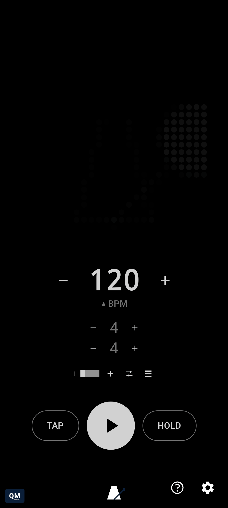

# Living on the Glyph Matrix

[← Using qMetronome](README.md) · [Root README](../../README.md)

Activate qMetronome once from Settings → **Activate as Glyph Toy**, which registers it with
Nothing's Glyph Button toy carousel; after that it's selected and deselected like any other toy.
Selecting or deselecting it on the Glyph Button starts or stops the metronome - intentionally, not
a bug - which also means unlocking the phone while the toy is showing stops playback too, since the
Nothing OS Glyph Interface itself closes on unlock and there's no way to tell that apart from a
deliberate toy swap.

If you just want playback to survive the screen turning off, raising your phone's own screen
timeout (or disabling screen-off) while keeping qMetronome open works today with no extra setup.
For backgrounded, screen-locked, or switched-away-from-the-toy cases, Settings → Playback →
"Persistent playback" keeps the engine running independent of the toy's bind state, via a quiet
foreground-service notification - opt-in, off by default, and the notification/battery-optimization
prompts it may trigger are nudges rather than requirements.

While the toy is showing, touching the Glyph Button taps tempo the same way tapping the BPM number
does, and a long-press cycles through visualizers. The on-screen preview mirrors the exact same
gestures: swiping it left or right also cycles visualizers, double-tapping toggles play/stop, and
long-pressing it opens Settings - all in addition to, not instead of, the dedicated buttons. Even
at rest, the preview (and the real Glyph Matrix) shows a faint ghost of the current visualizer
rather than going fully dark, so the display always reads as "on." Random mute, in Settings, is a
practice tool in the same spirit - it skips the audible click on a probabilistic subset of beats
(ramping up gradually if you enable progressive start) without ever touching the underlying beat,
so you can wean off leaning on every click without the tempo itself drifting. Want your own
animation on the matrix instead of the built-in ones? See
[Adding a new visualizer](../adding-a-new-visualizer.md).

Every gesture here also has its own screenshot/video page in
[the user guide](../../docs/user-guide/README.md#glyph-matrix).
