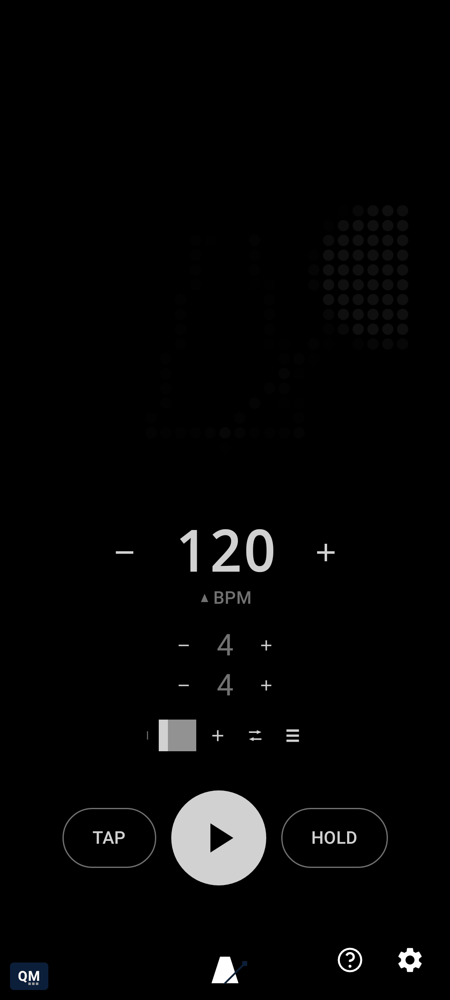
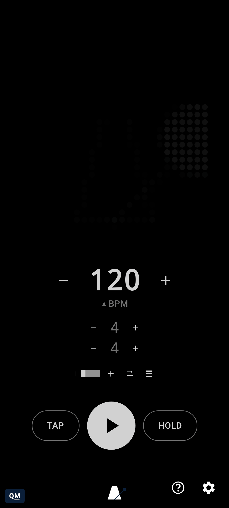

# Planning a set with the bar queue

[← Using qMetronome](README.md) · [Root README](../../README.md)

Below the tempo controls, the time signature shows as two independently steppable numbers stacked
vertically (beat count over note value - a real time signature, not a fraction), and just beneath
that is a second, smaller row for queuing up a sequence of differently metered *and* differently
paced bars. Say a song has three bars of 4/4 at 90 BPM before a one-bar 3/4 turnaround at 140 BPM -
build that once, ahead of time, and qMetronome cycles through it live rather than you riding the
tempo/meter controls in real time and hoping you land the change on the beat.

Every bar in the queue remembers its own beats-per-bar, note value, and tempo - tap a bar to jump
to it and its settings recall exactly as you left them; adjust the active bar the normal way
(tap/steppers/drag/long-press on the BPM number) and only that bar changes. The `+` button appends
a copy of whichever bar is active and jumps to it; `−` removes the active bar; both are no-ops if
it's the only one left. The trash icon at the far left - flagged with a small red dot as a
destructive, unrecoverable action - clears the whole queue back to a single default bar, for
starting over rather than trimming bars one at a time.

Each bar renders as a rectangle sized to carry information at a glance: width scales with beat
count relative to the rest of the queue (the longest bar reads as the widest rectangle), height
scales with tempo (faster bars read taller), and each bar is divided into one segment per beat so
the count reads directly off the shape. Only the active bar's current-beat segment pulses, and the
active bar itself reads brighter than the rest. Long-press any bar to remove it directly, in
addition to the `−` button.

A mode icon at the far right controls how the queue advances at each bar boundary during playback:
**Loop** (default) wraps back to the first bar after the last; **Once** stops advancing once it
reaches the last bar, holding there rather than stopping playback outright; **Manual** never
auto-advances, so only tapping a bar's dot moves it - useful for a set where you want to trigger
the next section on cue rather than on a fixed schedule. With only one bar - the default - this
whole row is inert; there's nothing to queue yet.

The same "which bar, which beat" information is echoed ambiently on the Glyph Matrix itself,
blended in behind whichever visualizer is selected rather than replacing it - loosely a line of
sheet music, one horizontal row per bar stacked in queue order, ticking left to right. It's a
passive cue, not a second control surface: once a queue gets busy enough for individual bars to
blur together on the small shared canvas, the dedicated bar row above is still the precise way to
navigate it. The queue, which bar is active, and the advance mode all persist across restarts, same
as tempo and beats-per-bar always have.

## Grouping bars into phrases

A single bar queue is enough for a lot of songs, but a real set often has distinct sections - a
verse groove, a different chorus meter, a bridge at another tempo entirely. A small icon at the end
of the bar-queue row adds a **phrase**: a song-form section with its own complete bar queue - own
bars, own add/remove/dots, own advance mode - exactly like the one you already know, just one level
up. With a single phrase (the default), this is the only trace of the feature on screen; nothing
else changes, and there's nothing to learn until you actually add a second one.

Once a second phrase exists, a full phrase-management strip appears below the bar queue, mirroring
it control for control: a trash icon to collapse back to one default phrase, `−` to remove the
active phrase, one dot per phrase (tap to jump to it and land on its first bar, long-press to
remove it directly), `+` to add another, and a mode icon cycling **Loop**/**Once**/**Manual** - the
same three choices the bar queue's own mode uses, now governing how playback flows from one phrase
into the next. A phrase set to **Once** hands off to the next phrase (per the phrase-level mode) the
moment its own bars run out; **Loop** keeps a phrase playing indefinitely until you switch away
manually. Removing phrases back down to just one makes the whole strip disappear again - it only
exists while there's more than one phrase to manage.

Each phrase's dot is itself a small vertical stack of thin bar-segments, one per bar in that
phrase, each segment's width echoing that bar's beat count relative to the others in the same
phrase - a miniature version of the bar queue's own width-scaled rectangles above, giving a
phrase's own rough shape at a glance without needing to open it. With more than one phrase queued,
a small dot per phrase additionally appears around the physical Glyph Matrix's outer rim (and its
on-screen preview mirror) - the active phrase reading brighter than the rest - independently
toggleable from the bar-queue background in Settings → Visualizer.

Every gesture here also has its own screenshot/video page in
[the user guide](../../docs/user-guide/README.md#bar-queue).
