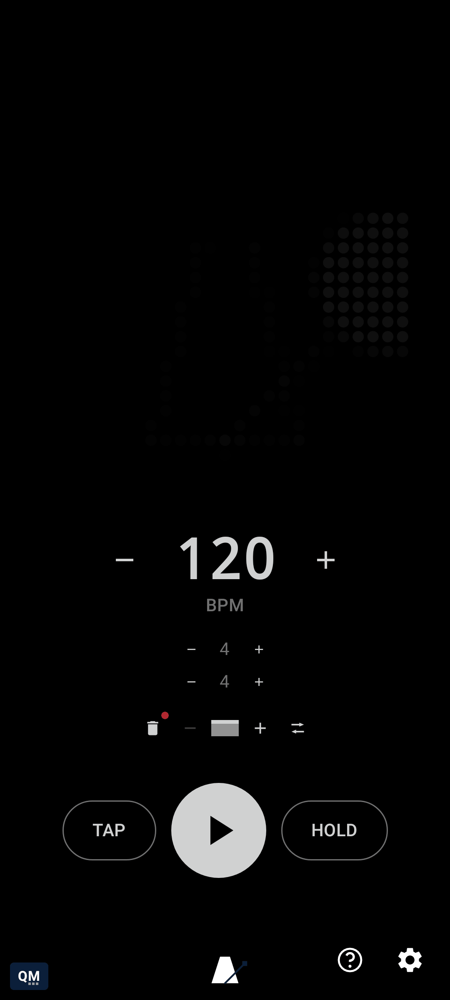

# Staying in sync with other gear

[← Using qMetronome](README.md) · [Root README](../../README.md)

Settings → Clock → "Send MIDI clock" turns qMetronome into a MIDI clock source (24 ppqn) for other
apps or USB gear - the mirror image of following an external clock, which happens automatically
the instant MIDI Clock activity arrives from another app or a connected USB device, falling back to
internal timing if that feed goes quiet. USB devices get their own row in Settings → MIDI, with
independent "Follow clock" and "Send clock" toggles per device, so a device can be followed, sent
to, both, or neither; long-press a device to star it, and it reconnects automatically - restoring
whichever connections were active - the next time it's plugged in, whether or not Settings happens
to be open at the time. "Outgoing clock feel" (Mechanical vs. Organic), shown above, only affects
the clock *sent* to other gear, not this app's own click or flash: Mechanical actively corrects it
for the truest, most locked-in beat; Organic lets a followed clock's own natural timing variance
through unfiltered. See [`docs/external-midi-clock.md`](../../docs/external-midi-clock.md) for the
full design rationale behind both directions.

## Sending a MIDI note or CC per beat type

Settings → MIDI Actions turns qMetronome into more than a clock source: any beat type - Bar, Beat,
Accent, Strong Accent, or Custom - can send its own MIDI Note or CC message, over the same
virtual/USB connections "Send clock" above already reaches. Pick a type per beat, then its channel,
note/CC number, and velocity/value (plus how long a Note stays on before its matching Note Off).
This runs independently of the audible click - beat actions still fire whether Click is on or off,
and whether or not a given beat happens to be randomly muted for practice, since external gear and
lights shouldn't hiccup because of a performer's own practice settings.

Reaching anything beyond Bar and Beat first needs marking which beats in a bar count as Accent,
Strong Accent, or Custom: long-press the beats-per-bar number to open time signature entry, and
below the usual beat-count/note-value fields is a chip per beat - beat 1 is always a fixed "Bar"
chip, and tapping any other one cycles it through the three accent tiers and back to unmarked. The
same marks drive both the audible click's tone (Settings → Click already has a tab per tone) and
whichever MIDI action is configured for that type.

## Overriding one beat, or one phrase

A beat type's own default is a broad brush - Settings → Beat Overrides lets one *specific* beat
carry its own MIDI action that wins over whatever its type would otherwise send, without changing
that beat's accent or its click tone. Browse to any phrase and bar first (the same dot pickers the
main screen's own phrase/bar queues use, shown only once there's more than one to choose from),
step to the beat within it, and assign the override there - it lands on exactly that beat, not
"whichever bar happens to be playing right now." Settings → Phrase Actions works the same way one
level up: pick a phrase via its dot and give it its own MIDI action, fired once every time you jump
to that phrase - tapping its dot on the main screen, or arriving there automatically as the queue
advances.

To sanity-check either without starting playback, latch HOLD (long-press or double-tap it) while
MIDI Actions is on - TAP swaps to a lightning-bolt Trigger button for as long as the latch holds,
firing whatever's actually configured for the engine's live current beat each time you tap it. See
[Dialing in a tempo](dialing-in-a-tempo.md) for more on latching HOLD itself.

Every gesture here also has its own screenshot/video page in
[the user guide](../../docs/user-guide/README.md#midi-clock).
